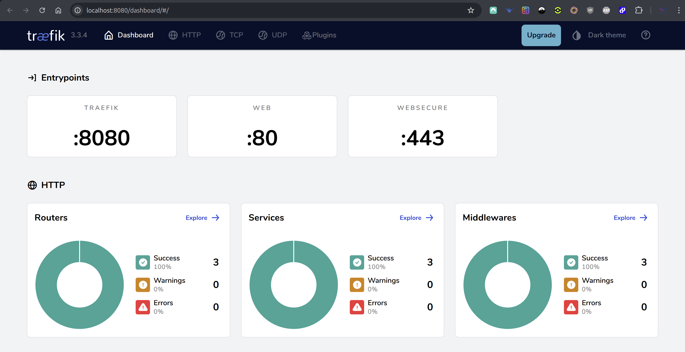

# traefik-reverse-proxy
Traefik reverse proxy with SSL for local development with docker using custom *.dev wildcard domain.

> Use single instance of traefik as a reverse proxy to route all local docker apps through it and 
> associate a custom domain for each app, e.g. https://my-app-1.dev, https://my-app-2.dev etc...

## Prerequisite
- [Ubuntu](https://ubuntu.com/download/server)
- [Make](https://askubuntu.com/questions/161104/how-do-i-install-make)
- [Git](https://git-scm.com/book/en/v2/Getting-Started-Installing-Git)
- Docker ([Part-1](https://docs.docker.com/engine/install/ubuntu/) & [Part-2](https://docs.docker.com/engine/install/linux-postinstall/))

## Installation

1. G
2. 